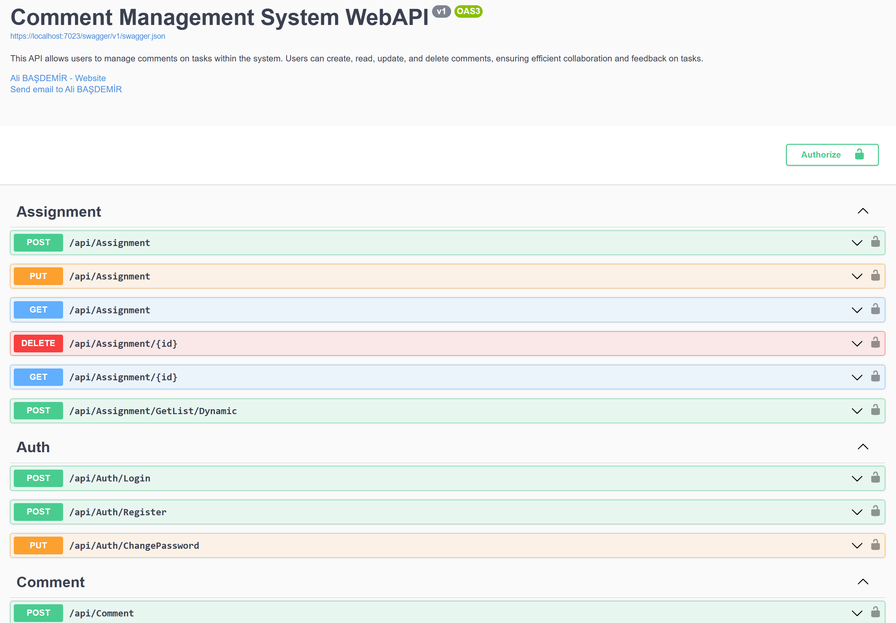
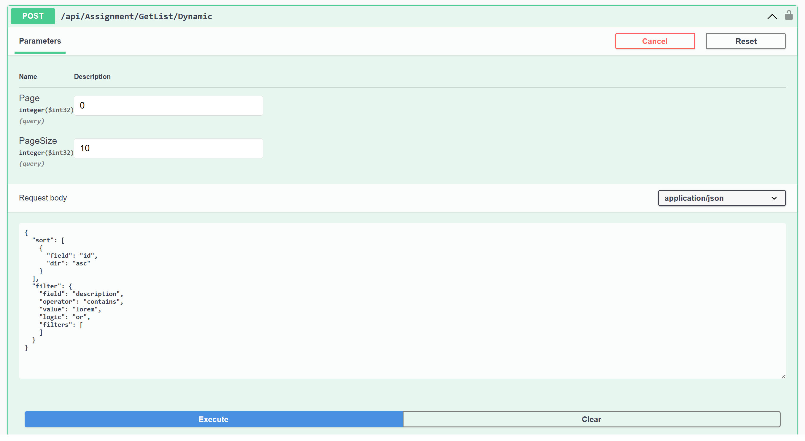
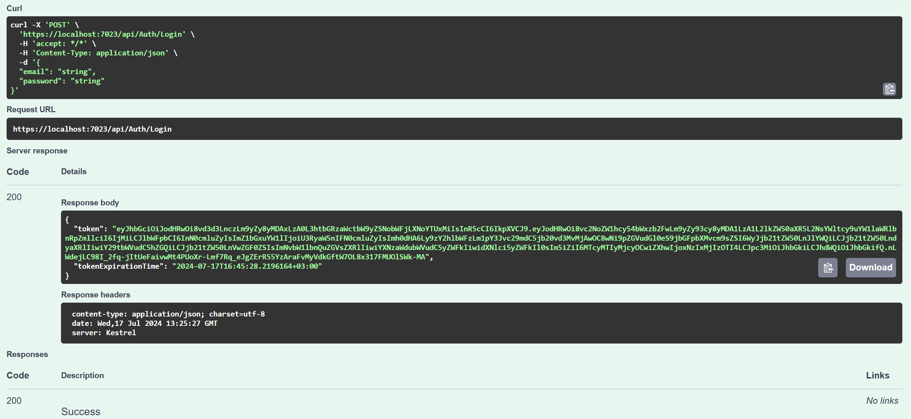
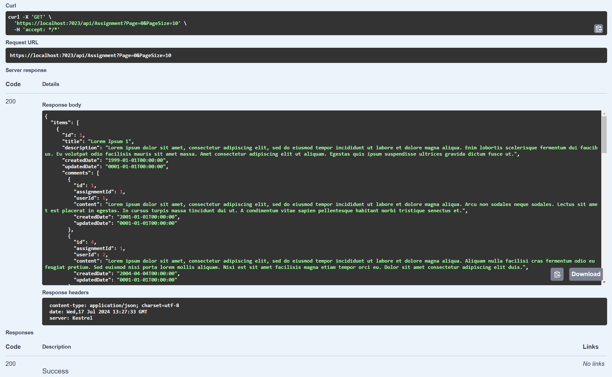
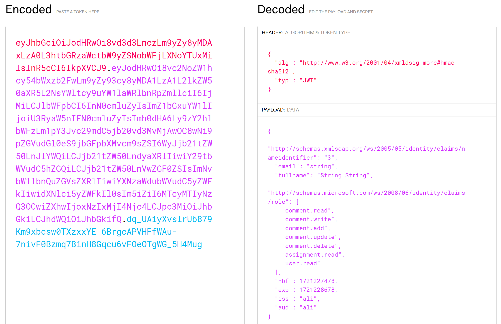
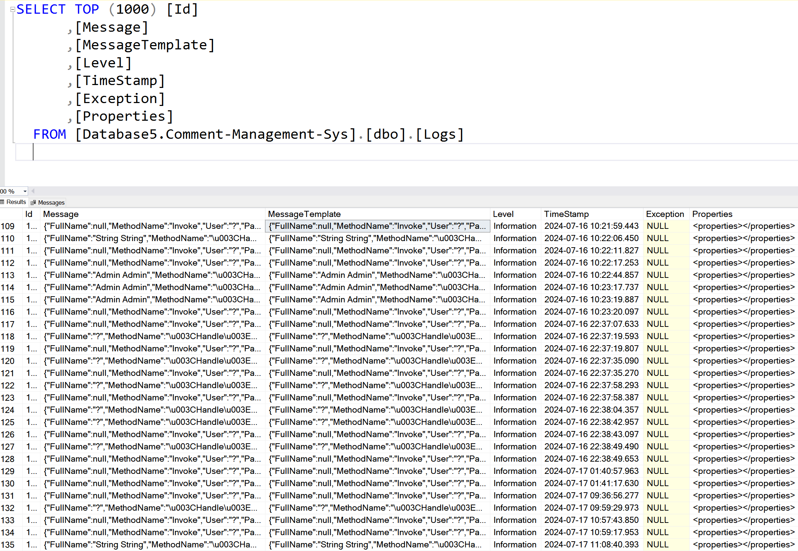
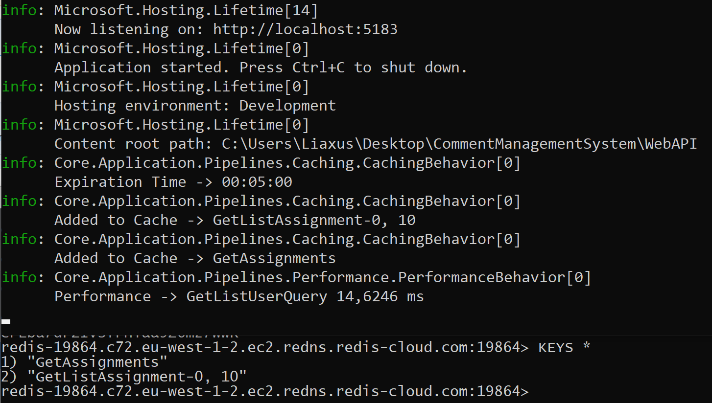

# .NET Onion Architecture Task Management System

This project is a comment management system developed using .NET Onion Architecture. This API allows users to manage comments on tasks within the system. Users can create, read, update, and delete comments, ensuring efficient collaboration and feedback on tasks. 

The project uses a structure where data is stored in an MSSQL database. Additionally, there are extra features such as *user management, roles, logging, caching, and performance measurement*.

The project utilizes technologies such as **.NET Core, Entity Framework, CQRS, LINQ, DTO, MediatR, AutoMapper, FluentValidation, Global Handling Exception, JWT, Pipelines, Redis Cache, Serilog, Dynamic.LINQ, MailKit, and MimeKit.**

## Key Features:

- **Comment Management:** 
Users can add comments to tasks, edit existing comments, delete comments, and retrieve a list of comments. Additionally, comments can be filtered based on specific criteria to enhance usability.

- **Authorization and Authentication**
The project uses JWT (JSON Web Token) for user authorization and authentication. Roles can be assigned to each user, and authorization operations are performed based on these roles. User information (email, firstname, lastname, and roles) is stored within the token. User roles are maintained in the OperationClaim and UserOperationClaim tables.

- **Hashing and Salting**
Hashing and salting are used to securely store user passwords. Hashing converts the password into a fixed-length string, while salting adds a unique value to each password before hashing, providing an additional layer of security against attacks.

- **Business Rules**
Business rules define the logic and constraints that govern how the application behaves. These rules are essential for ensuring data integrity and enforcing the policies that dictate application functionality.

- **Email Verification**
When users register, a 6-digit verification code is sent to their email addresses. They must enter this code in the email verification field to verify their account. Verified users can log in, while unverified users receive a warning upon login. MailKit and MimeKit are used for sending emails.

- **Global Handling Exception**
Global exception handling ensures that any unhandled exceptions within the application are captured and processed uniformly. This prevents sensitive information from being exposed and provides a consistent response structure for API clients.

- **Dynamic Filter**
Dynamic filtering allows the application to apply filters to data queries at runtime, enabling more flexible and efficient data retrieval based on user input or specific conditions.

- **Pagination**
Pagination helps manage large datasets by splitting them into smaller, manageable chunks. This improves performance and usability, making it easier for users to navigate through data sets.

- **Logging**
The application uses Serilog for logging. Logs are stored both as files and in the MSSQL database. Global exception handling and other operation details are logged. Related classes are located in the CrossCuttingConcerns folder.

- **Caching**
Caching operations are performed using Redis Cloud. A caching mechanism is utilized to enhance the performance of requests. To add cache, the ICachableRequest interface is used, and to remove from cache, the ICacheRemoverRequest interface is utilized.

- **Validation**
Input validation is performed using FluentValidation. For example, rules are defined here to ensure that the email field is in the correct format and that passwords meet a certain length.

- **Performance Measurement**
Performance measurements are taken during list retrieval operations. These measurements are used to determine how long requests take and are displayed in the Visual Studio debug console.

## Project Architecture

### Layers

- **Domain**
This layer includes the entities.

- **Persistence**
This layer serves as the data access layer and performs database operations using Entity Framework Core. Concrete repository classes are located here. Separate concrete repositories have been created for each entity.

- **Application**
The application layer implements the CQRS (Command Query Responsibility Segregation) pattern and contains business logic and business rules. This layer includes DTOs, CQRS pattern; commands, queries, and handlers. Service registrations and dependencies are also defined here. And defines services, contains abstract repositories.

- **Core**
This layer contains core functionalities such as middleware, including global exception handling, as well as pipelines and other components that are independent of external services. These components are designed for easy reuse in other projects.

- **WebAPI**
The WebAPI layer exposes RESTful APIs. Controllers and API endpoints are found here.

- **Infrastructure**
This layer contains implementation details that support the application, such as external services. For instance, the mail service for sending emails is implemented here, allowing for integration with email providers and managing email-related operations.

## Technologies and Tools Used

- **Architecture**: Onion Architecture
- **Framework**: .NET Core 8
- **ORM**: Entity Framework Core
- **Database**: MSSQL
- **Design Patterns**: CQRS, Repository Pattern, Dependency Injection
- **Data Transfer**: DTO(Data Transfer Object)
- **Mapping**: AutoMapper
- **MediatR**: Implements CQRS pattern using MediatR library.
- **Business Rules**: Separate business rules implemented for each entity.
- **Pipeline**: Pipeline behaviors for authorization, caching, logging, performance measurement and validation.
- **Validation**: FluentValidation
- **Caching**: Redis
- **Logging**: Serilog (for file and mssql)
- **Exception Handling**: Global Exception Handling(middleware)
- **Security**: JWT (JSON Web Token)
- **Encryption**: Hashing and Salting
- **Pagination**: Pagination for all GetList methods.
- **Performance Measurement**: Simple mechanism for performance measurement in milliseconds.
- **Email Service**: MailKit and MimeKit (for Email verification)
- **Dynamic Filtering**: Dynamic.LINQ

## API Endpoint Overview

This project utilizes the following API endpoints for interaction with various resources:

- **Assignment:** POST (Create), PUT (Update), DELETE (Remove), GET by ID (Retrieve details), GET list (List all), GET list dynamic (Filter).
- **Comment:** POST (Create), PUT (Update), DELETE (Remove), GET by ID (Retrieve details), GET list (List all), GET list dynamic (Filter).
- **Auth:** POST (Login), POST (Register), PUT (Change password).
- **RegisterWithEmail:** POST (Register), POST (Verify email), POST (Login).
- **OperationClaim:** POST (Create), PUT (Update), DELETE (Remove), GET by ID (Retrieve details), GET list (List all).
- **UserOperationClaim:** POST (Create), PUT (Update), DELETE (Remove), GET by ID (Retrieve details), GET list (List all).
- **User:** POST (Create), PUT (Update), DELETE (Remove), GET by ID (Retrieve details), GET list (List all).

Each endpoint is designed in accordance with RESTful principles to support the core functionality of the project.

## Installation and Running the Project

### Prerequisites

- .NET 8 SDK
- MSSQL Server
- Redis Cloud account
- SMTP (for email service)

### Steps

1. **Clone the Repository**

```
git clone this repository
cd <your-repository-directory>
```

2. **Install Dependencies**

```
dotnet restore
```

3. **Configure Connection Strings**

Update the *appsettings.json* file with your database connection strings (and look BaseDbContext in Persistence Layer), Redis configuration and email configuration


4. **Run Migrations**

*Tools -> NuGet Package Manager -> Package Manager Console*

```
Add-Migration MigrationName
Update-Database
```

**Note:** After running the migrations, your database will be populated *with seed data*, ensuring that you have initial data available for use.

5. **Run the Application**

```
dotnet run
```

### Testing the API

You can use tools like *Postman* or *curl* to test the API endpoints once the application is running. Additionally, *Swagger* is already set up in this project, allowing you to directly explore and test the API endpoints through its interactive interface.

## Contribution

If you would like to contribute to this project, please open an issue first to discuss what you would like to change.

## Screenshots



--------------------------------------------------------------------



--------------------------------------------------------------------



--------------------------------------------------------------------



--------------------------------------------------------------------



--------------------------------------------------------------------


--------------------------------------------------------------------


